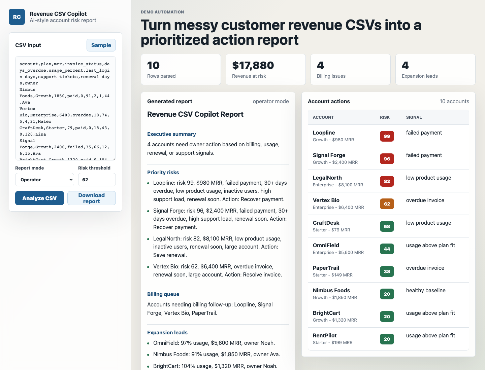

# Revenue CSV Copilot

A browser-only AI-style demo that turns account revenue CSV data into a prioritized operating report. It parses CSV rows, scores churn and billing risk, identifies expansion leads, and exports a Markdown report.

[Live demo](https://rabbit57.github.io/revenue-csv-copilot/)



## Why this demo exists

This is a compact portfolio piece for selling fixed-scope AI data automation work. It shows how a buyer can move from raw CSV to useful decisions without a meeting:

- paste or load customer/account CSV data
- classify billing, churn, adoption, support, and expansion signals
- produce a concise executive report
- turn account rows into clear owner actions
- download the report as Markdown

The demo uses deterministic browser logic so it works without keys. In a paid version, the report layer can be replaced with an LLM call and the output can be pushed into HubSpot, Salesforce, Notion, or Slack.

## Run locally

Open `index.html` directly in a browser, or serve the folder:

```bash
python3 -m http.server 4174
```

Then visit:

```text
http://localhost:4174
```

## Expected CSV columns

```text
account,plan,mrr,invoice_status,days_overdue,usage_percent,last_login_days,support_tickets,renewal_days,owner
```

## Files

- `index.html`: app shell
- `src/app.js`: CSV parsing, scoring, report generation, and export
- `src/styles.css`: responsive UI
- `data/sample-accounts.csv`: sample input data
- `screenshots/dashboard.png`: demo screenshot

## Customization ideas

- Replace the local scoring rules with an OpenAI-compatible summary layer.
- Add real CSV file upload and schema mapping.
- Send high-risk accounts to CRM tasks grouped by owner.
- Add automated weekly reports from Google Sheets or a data warehouse.
